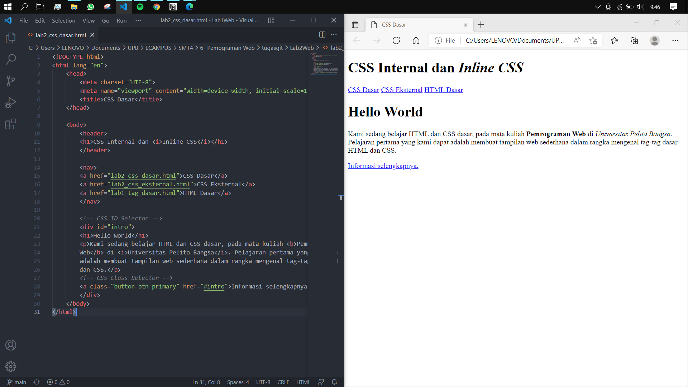
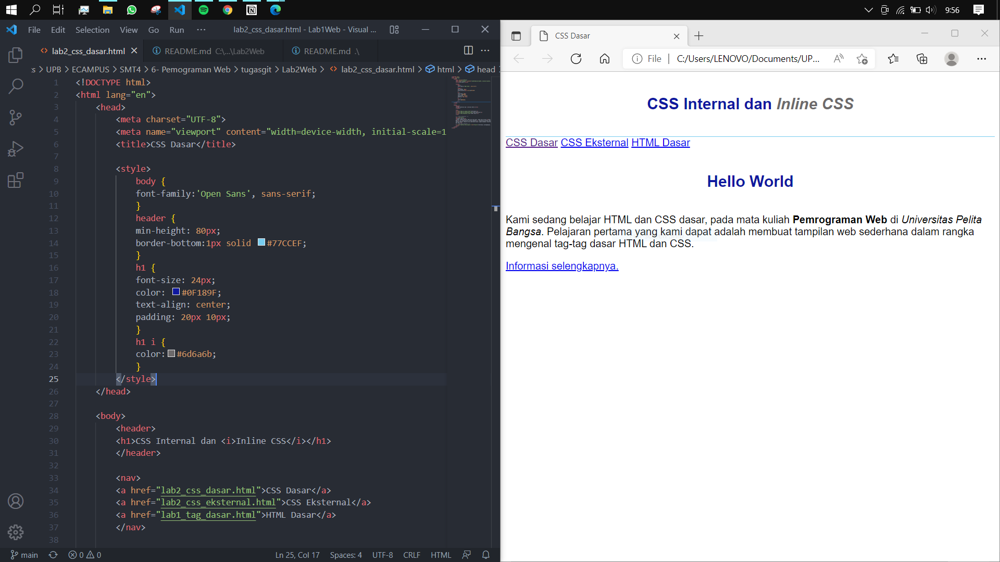
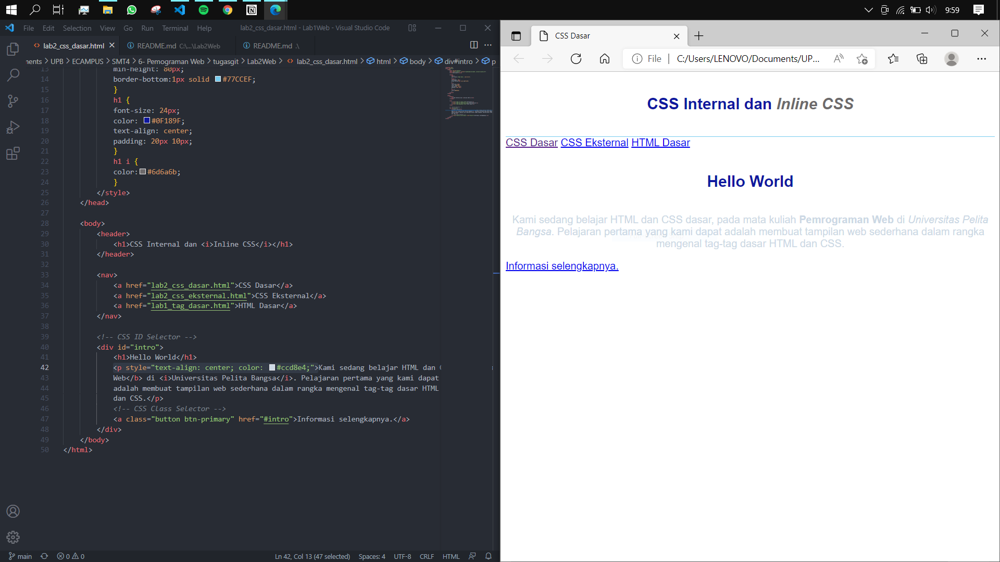
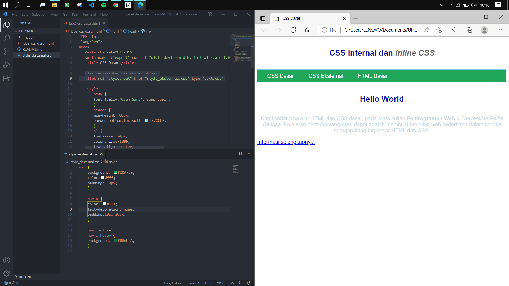
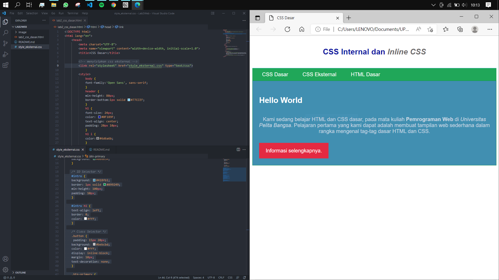
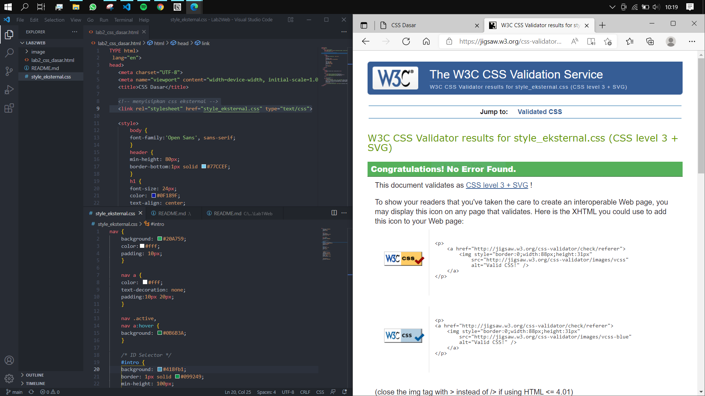

# LAB2 Web

<table border="2" cellpading="10">
  <tr>
    <td><b>Nama</b></td>
    <td>Ilham Nur Utomo</td>
  </tr>
  <tr>
    <td><b>NIM</b></td>
    <td>312010129</td>
  </tr>
  <tr>
    <td><b>Kelas</b></td>
    <td>TI.20.A1</td>
  </tr>
  <tr>
    <td><b>MataKuliah</b></td>
    <td>Pemrograman Web</td>
  </tr>
</table>

# <b>Praktikum</b>

## <b>1. File HTML awal</b>

## <b>2. Deklarasi CSS internal</b>

## <b>3. Inline CSS</b>

## <b>4. External CSS</b>

## <b>5. Selector CSS</b>

## <b>Validasi dokumen CSS

# Latihan
<b>1. Lakukan eksperimen dengan mengubah dan menambah properti dan nilai pada kode CSS dengan mengacu pada CSS Cheat Sheet yang diberikan pada file terpisah dari modul ini.</b>
  - Jawaban = 

