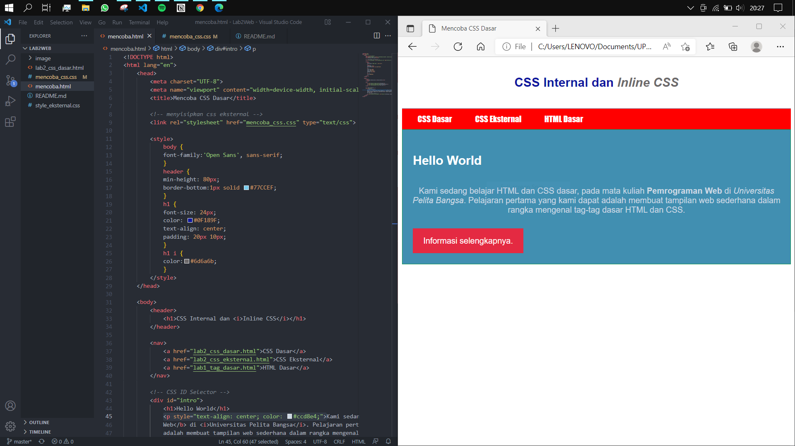
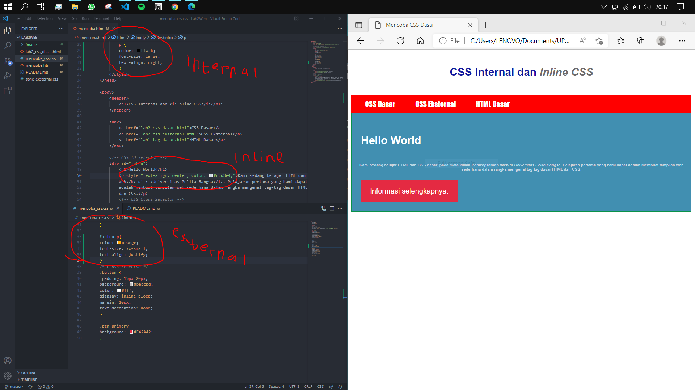
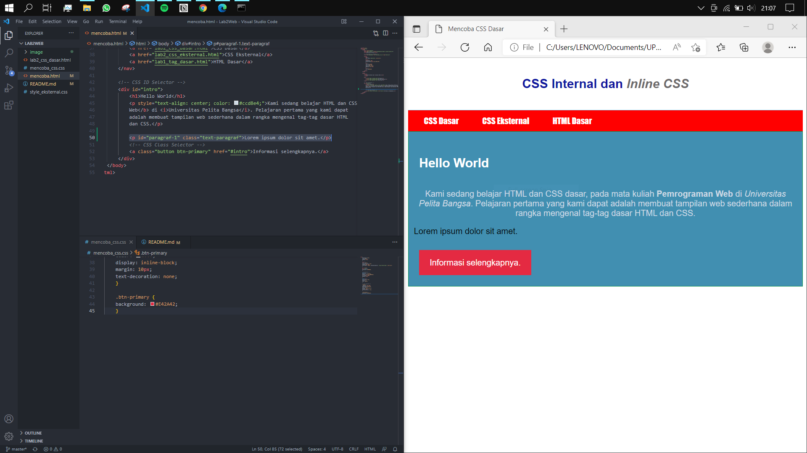
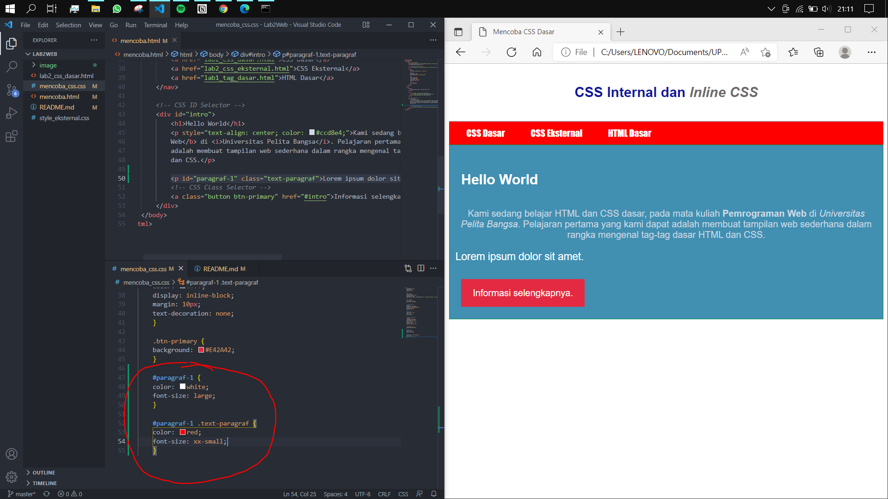
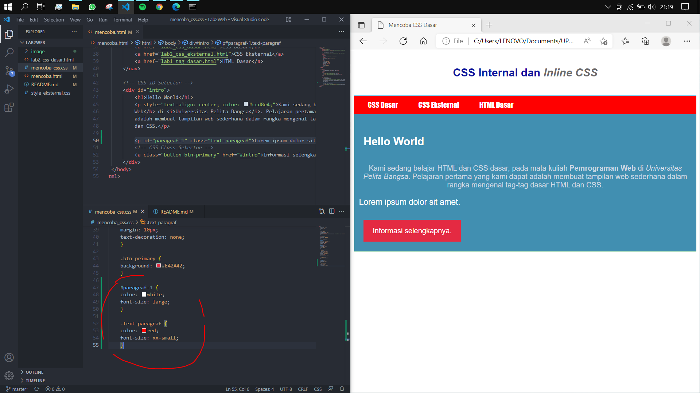

# LAB2 Web

<table border="2" cellpading="10">
  <tr>
    <td><b>Nama</b></td>
    <td>Ilham Nur Utomo</td>
  </tr>
  <tr>
    <td><b>NIM</b></td>
    <td>312010129</td>
  </tr>
  <tr>
    <td><b>Kelas</b></td>
    <td>TI.20.A1</td>
  </tr>
  <tr>
    <td><b>MataKuliah</b></td>
    <td>Pemrograman Web</td>
  </tr>
</table>

# <b>Praktikum</b>

## <b>1. File HTML awal</b>

## <b>2. Deklarasi CSS internal</b>

## <b>3. Inline CSS</b>

## <b>4. External CSS</b>

## <b>5. Selector CSS</b>

## <b>Validasi dokumen CSS

# Latihan
<b>1. Lakukan eksperimen dengan mengubah dan menambah properti dan nilai pada kode CSS dengan mengacu pada CSS Cheat Sheet yang diberikan pada file terpisah dari modul ini.</b> 
  - Jawaban = 
  - Membuat file baru, ``mencoba.html`` dengan eksternal css ``mencoba_css``.

  - Kode awal,
   
  
  - Setelah perubahan,
 

  - Mengubah warna ``nav`` menjadi merah pada file ``mencoba_css.css``, dengan mengganti nilai dari properti ``background``.
  - Menambahkan font khusus untuk <i>hyperlink</i> yang ada di ``nav a``, menjadi <b>IMPACT</b>, tidak berpengaruh pada tag lain.  

<b>2. Apa perbedaan pendeklarasian CSS elemen ``h1 {...}`` dengan ``#intro h1 {...}``? berikan penjelasannya!</b>
  - Jawaban =

  - Dengan ``#intro h1``,
 
  
  - Tanpa ``#intro h1``, hanya ``h1``,
 

  - ``h1`` merupakan <i>element selector</i> yang umum pada tag html, namun karena selektor tersebut dibawah pengaruh ``id=intro``, 
 maka css eksternal kebingungan mencari ``h1`` yang dimaksud. Tampilah ``h1`` yang ada di internal css ``mencoba.html``. 

  - ``#intro h1`` merupakan <i>id selector</i>, sehingga pemformatan ``h1`` akan mengikuti ``#intro``.  

<b>3. Apabila ada deklarasi CSS secara internal, lalu ditambahkan CSS eksternal dan inline CSS pada elemen yang sama. Deklarasi manakah yang akan ditampilkan pada browser? Berikan penjelasan dan contohnya!</b>
  - Jawaban = Deklarasi terakhir,

  - Kode sebelum,
 

  - Kode sesudah,
 

  - <b>Internal CSS</b> membuat tag ``
`` berwarna hitam, ukuran huruf besar, serta teks rata kanan. Namun tidak tereksekusi, karena masih ada kode selanjutnya (yang mirip).
  - <b>Eksternal CSS</b> membuat tag ``
`` berwarna oranye, ukuran huruf sangat kecil, serta teks rata kanan-kiri. Namun tidak tereksekusi seluruhnya, hanya ukuran huruf.
  - <b>Inline CSS</b> membuat tag ``
`` berwarna biru pudar, ukuran huruf masih dari <b>eksternal css</b>, aserta teks rata tengah. Maka kode yang tampil adalah: Teks rata tengah, warna biru pudar, ukuran sangat kecil.
  - CSS mengambil kode program yang terakhir.
  - Internal kemudian > Eksternal kemudian > Inline CSS  

<b>4. Pada sebuah elemen HTML terdapat ID dan Class, apabila    asing-masing selector tersebut terdapat deklarasi CSS, maka deklarasi manakah yang akan ditampilkan pada browser? Berikan penjelasan dan contohnya! (
)</b>
  - Jawaban = ID
   
  - Kode sebelum,
 

  - Kode sesudah,
 
 

  - ``id`` unik, digunakan pada tempat tertentu.
  - ``class`` lebih umum, sering digunakan untuk beberapa elemen.
  - ``id`` akan lebih ditampilkan.